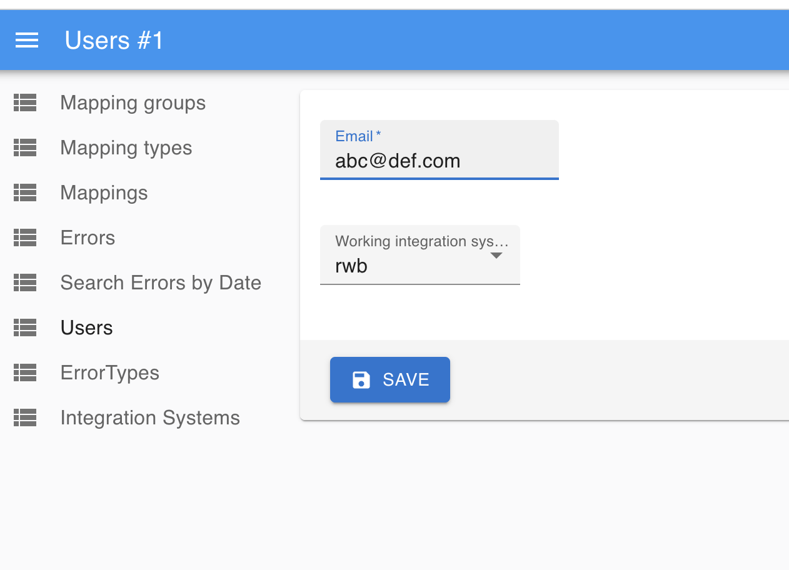

## Purpose

RWB integration service is aimed at identifying Field Users, who meet all the following criteria:
- Didn't create or edit any registrations or encounters in the past X days
- User belong to 'Primary Users' user group
- Should consider users who have in their catchment
  - Atleast one "Workorder", without a "Workorder Endline" encounter OR
  - No "Workorder"
- The Status(Success / Failure) to Nudge a User should be Recorded for Reporting purposes

For users thus identified, we are supposed to Nudge them on their Registered Mobile numbers on Whatsapp, through Glific, for taking action on the Avni Gramin App.

## Design

RWB integration service is built to service multiple Production organisations using a single integration instance. To do this, we make use of RWBContextProvider, a ThreadLocal store, which stores the IntegrationSystemInstance information corresponding to each Production Organisation.

## Configuration

### Avni Organisation configuration

#### Create an API user on target Organisation

Create a new "Organisation Administrator" User that will be used to invoke the APIs as well as act as sender of Glific messages for the organisation.

Refer to [Avni Readme](https://avni.readme.io/docs) for more help regarding this.
Ensure that the OrgAdmin user's password is not a temporary one, login into Avni webapp and confirm once.

#### Setup Glific to work with the org

Connect to target environment DB and assume the role of the org's dbuser.
```sql

set role '<org_dbuser>';
INSERT INTO public.external_system_config (id, organisation_id, uuid, is_voided, version, created_by_id, last_modified_by_id, created_date_time, last_modified_date_time, system_name, config) VALUES (DEFAULT, <org_id>, uuid_generate_v4(), false, 1, 1, 1, now(), now(), 'Glific', '{"phone": "91Number", "baseUrl": "https://api.<org>.glific.com", "password": "<pwd>", "avniSystemUser": "<user>@org"}');

```

#### Setup Custom Query to be used to fetch "Inactive Users"

[Sql command to insert CustomQuery](src/main/resources/custom_query_insert.sql)

### Integration system configuration

#### Create a new working Integration System, corresponding to target organisation, if not already existing

Make use of the Organisation "dbuser" name as "Instance name" and create a new working_integration_system in the target Avni-Integration environment. Ensure that you set the "System type" to "rwb". Connect to "avni_int" DB on the target env DB and invoke below command.

```sql
INSERT INTO public.integration_system (id, name, system_type, uuid, is_voided)
VALUES (DEFAULT, '<org_dbuser>'::varchar(250), 'rwb'::varchar(255), uuid_generate_v4(), false::boolean);
```

#### How to Configure the Admin users to use specific working_integration_system
**Please ensure that you edit the admin user to point to the right working_integration_system. This can be done by updating through SQL command, or easier still by logging into the Integration-Admin-app and editing user to set it to required working_integration_system.**



Steps for Integration Bundle migration from UAT to Prod are as follows using the “Avni integration” postman collection.

### How to set up the new IntegrationSystemInstance using Integration Server APIs
Integration service provides the ability to download implementation-specific configuration files from one environment/system and upload it to another environment.
“Avni integration” Postman collection for Integration service Bundle export-import is available [here](https://drive.google.com/drive/folders/1XjWYQsLUCJuPxwDbtHvTreHrsF3VQJId).
Download the postman collection and using Postman App / Webapp, import the postman collection and create required RWB-Prod and RWB-Staging Postman Environments.

####  Download the integration bundle from UAT org / Staging env org
- Log in to [RWB Staging integration](https://etl-staging.rwb.avniproject.org](https://etl-staging.rwb.avniproject.org/avni-int-admin-app/index.html#/login) using the rwb-int-staging admin user with the “int login” API request
- Invoke the "int current user" API request and confirm that the working_integration_system is as desired
- Invoke “int Bundle export” API request, to download the bundle
- Logout using the “int logout” API request


####  Upload the integration bundle to Prod env target org
- Log in using [RWB Prod integration](https://etl.rwb.avniproject.org/avni-int-admin-app/index.html#/login) using the rwb-int-prod user admin with the  “int login” API request
- Invoke the "int current user" API request and confirm that the working_integration_system is as desired
- Invoke “int Bundle import” API request, attaching the downloaded bundle as payload “bundleZip” field
- Logout with the “int logout” API request

### Update the value for secret properties using DB commands

Invoke below sql commands with appropriate replacements for updating the secret properties values. Connect to DB of target environment. 

```sql
select * from public.integration_system where name = '<rwb_org_dbuser>'; -- to determine "rwb_org_system_id"
UPDATE public.integration_system_config SET value = '<user>@<org>'::varchar(10000) WHERE key = 'avni_user' and  integration_system_id = '<rwb_org_system_id>'::integer;
UPDATE public.integration_system_config SET value = 'https://<sub-domain>.rwb.avniproject.org/'::varchar(10000) WHERE key = 'avni_api_url' and  integration_system_id = '<rwb_org_system_id>'::integer;
UPDATE public.integration_system_config SET value = '<password>'::varchar(10000) WHERE key = 'avni_password' and  integration_system_id = '<rwb_org_system_id>'::integer;
```

### Restart the RWB Target env Integration service, using shell commands

**Only when a new working_integration_system is added**, we would also need to restart the integration-service, by invoking below shell command:
```
#> sudo systemctl restart avni-int-service_appserver.service
```


